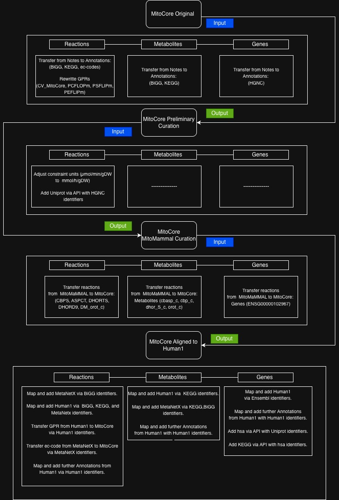

# MitoCore Curation for AutoPACMEN

MitoCore is a **small-scale metabolic model** curated for proteomics integration using an adapted **AutoPACMEN/sMOMENT** workflow. The goal of this workflow is to curate the annotations of MitoCore and release the model as an **open-source repository** for the community.

The latest MitoCore model (aligned to Human1) is stored in the **`Output_Models_MitoCore/`** directory as:

**`Mitocore_aligned_to_Human1.xml`**

---

## Table of Contents

- [Overview](#overview)
- [Scripts](#scripts)
- [Curation Steps](#curation-steps)
- [Directories](#directories)
- [Root Files](#root-files)
- [References](#references)

---

## Overview

The MitoCore curation workflow is designed to update MitoCore annotations (missing reactions, GPR and gene list, ec-code list, knowledge database identifiers) and facilitate **protein-allocation constraints** using the AutoPACMEN/sMOMENT methodology.

Minimal requirements for the format and annotations:

- **Format:** SBML3
- **Reactions:** EC-codes, KEGG identifiers, GPR associations
- **Metabolites:** BiGG identifiers, KEGG identifiers
- **Genes:** UniProt identifiers

---

## Scripts

| Script | Description |
|------|-------------|
| **MitoCore_curation.ipynb** | Curation script that takes the input MitoCore model and updates it in 4 stages, releasing 4 MitoCore outputs |
| **MitoCore_Metrics.ipynb** | MitoCore metrics comparison script that takes the 4 MitoCore outputs and compares them to evaluate updates across the curation stages |
| **Pathway_Coverage.ipynb** | Pathway coverage analysis between the latest updated MitoCore model and the large-scale model Human1 based on KEGG modules |

---

## Curation Steps

MitoCore was curated in one script that performs **4 steps, producing 4 output models**:

---

## Directories

| Directory | Description | Files |
|-----------|-------------|-------|
| [`Files_Databases`](Files_Databases/) | All files used during manual curation of MitoCore | Human1 cross-reference identifier TSV files for genes, metabolites, and reactions; MNX database TSV files for reactions and chemical compounds |
| [`Input_Models`](Input_Models/) | Contains the input root models: the original non-standardized MitoCore model in SBML2 format, and the models used to extract annotations and add them into MitoCore during curation (Human1 and MitoMammal) | |
| [`Output_Models_MitoCore`](Output_Models_MitoCore/) | Contains the 4 MitoCore output models generated during the different curation stages | *Note: Latest version is `Mitocore_aligned_to_Human1.xml`.* |
| [`Memote_Reports`](Memote_Reports/) | Contains the Memote snapshot reports for the 4 MitoCore output models across the curation stages | *Note: Latest version is `Mitocore_aligned_to_Human1.html`.* |
| [`Pathway_Coverage_Generated_Files`](Pathway_Coverage_Generated_Files/) | Contains the files generated by **Pathway_Coverage.ipynb** | |

---

## References

- [MitoCore Original](https://doi.org/10.17863/CAM.18582)
- [Human1 Metabolic Model](https://zenodo.org/doi/10.5281/zenodo.12523225)
- [Memote GEM Testing Tool](https://www.nature.com/articles/s41587-020-0446-y)
- [MitoMaMMAL](https://doi.org/10.1093/bioadv/vbae172)
- [AutoPACMEN Workflow](https://github.com/SystemsBioinformatics/AutoPACMEN)
- [sMOMENT Method](https://doi.org/10.1186/s12859-019-3329-9)

---
